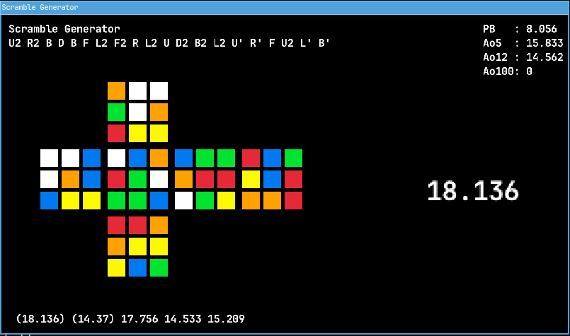

# Rubik's Cube Randomizer
This is a project that i thought would be fun to create.
It's written in Rust `1.78.0` and depends on `rand` crate for random number generation
and `raylibrs 3.7` for the GUI.

# Compile and run
Clone the repository, cd into the project and run:
```bash
cargo run --release
```
This might be changed in the future and i will add an installation skript.
# Controls
| Key           |                       Action                     |
|---------------|--------------------------------------------------|
| ESC           | Quit the Program                                 |
| Return        | Generate new Scramble                            |
| Space         | Start the inspection timer \ Stops the stopwatch |
| hold Space    | Get ready during inspection                      |
| release SPACE | start the timer                                  |

# Screenshot

